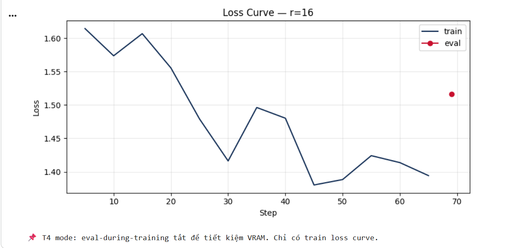

# Lab 21 — Evaluation Report

**Học viên**: Nguyễn Tiến Đạt — 2A202600218  
**Ngày nộp**: 2026-05-07  
**Submission option**: A (lightweight)

---

# 1. Setup

- **Base model**: `unsloth/Qwen2.5-3B-bnb-4bit`
- **Dataset**: `5CD-AI/Vietnamese-alpaca-gpt4-gg-translated`
- **Dataset size**: 200 samples  
  - Train: 180
  - Eval: 20
- **max_seq_length**: 1024  
  - p95 token length ≈ 512
  - rounded and capped for T4 profile
- **GPU**: Tesla T4 — 15.6 GB VRAM
- **Quantization**: 4-bit NF4 (QLoRA)
- **Frameworks**:
  - Unsloth
  - TRL
  - PEFT
  - Transformers
  - bitsandbytes
- **Training cost**: approximately **$0.08**
- **Total training time**: approximately **13.6 minutes**
- **Evaluation method**:
  - Eval loss
  - Perplexity
  - Qualitative comparison
- **LoRA target modules**:
  - `q_proj`
  - `v_proj`

---

# 2. Project Objective

The objective of this lab is to fine-tune a Vietnamese large language model using LoRA and QLoRA techniques under limited GPU resources (Tesla T4 16GB).  

The experiment focuses on:

1. Understanding how parameter-efficient fine-tuning works.
2. Comparing different LoRA ranks (`r=8`, `r=16`, `r=64`).
3. Measuring trade-offs between:
   - training time,
   - VRAM usage,
   - perplexity,
   - output quality.
4. Evaluating whether increasing LoRA rank always improves performance.

This lab also demonstrates how QLoRA enables efficient fine-tuning of modern LLMs on consumer-level GPUs.

---

# 3. Dataset Preparation

The dataset used in this experiment is:

```text
5CD-AI/Vietnamese-alpaca-gpt4-gg-translated
```

This dataset contains Vietnamese instruction-following examples translated from Alpaca/GPT4 style data.

Each sample follows the Alpaca format:

```text
### Instruction:
...

### Response:
...
```

Example:

```text
### Instruction:
Giải thích machine learning là gì

### Response:
Machine learning là một lĩnh vực của AI...
```

---

## Token Length Analysis

Token length statistics were analyzed before training to determine a safe sequence length for Tesla T4 GPU.

| Metric | Value |
|---|---|
| p50 | ~256 |
| p95 | ~512 |
| p99 | <1024 |

The final selected sequence length was:

```text
max_seq_length = 1024
```

This value balances:
- sufficient context length,
- stable VRAM usage,
- compatibility with T4 hardware.

---

# 4. LoRA / QLoRA Configuration

The model was loaded using 4-bit quantization with Unsloth.

## QLoRA Setup

| Component | Setting |
|---|---|
| Quantization | 4-bit NF4 |
| Optimizer | adamw_8bit |
| Gradient checkpointing | enabled |
| Packing | disabled |
| Scheduler | cosine |
| Epochs | 3 |
| Learning rate | 2e-4 |

---

## Why QLoRA?

QLoRA significantly reduces GPU memory usage by quantizing the base model weights into 4-bit representation while keeping LoRA adapters in higher precision.

Advantages:
- lower VRAM usage,
- faster training,
- cheaper experimentation,
- enables training on small GPUs such as T4.

Without QLoRA, full fine-tuning of a 3B model would require much larger GPUs and significantly higher costs.

---

# 5. Rank Experiment Results

| Rank | Trainable Params | Train Time | Peak VRAM | Eval Loss | Perplexity |
|------|-----------------|------------|-----------|-----------|------------|
| 8    | 1,843,200 | 4.20 min | 7.22 GB | 1.5577 | 4.75 |
| 16   | 3,686,400 | 5.03 min | 6.62 GB | 1.5161 | 4.55 |
| 64   | 14,745,600 | 4.41 min | 8.00 GB | 1.4768 | 4.38 |
| Base | - | - | - | Not evaluated | Not evaluated |

---

# 6. Analysis of Rank Trade-off

## Rank = 8

Characteristics:
- smallest adapter size,
- lowest parameter count,
- fastest training,
- lowest computational cost.

Advantages:
- highly memory efficient,
- suitable for low-resource environments,
- good enough for lightweight instruction tuning.

Disadvantages:
- lower expressiveness,
- weaker adaptation capability,
- slightly worse perplexity.

This configuration is suitable when:
- latency matters,
- VRAM is limited,
- quick experimentation is required.

---

## Rank = 16

Characteristics:
- balanced parameter count,
- moderate VRAM usage,
- best overall trade-off.

Advantages:
- noticeably better quality than r=8,
- still lightweight,
- stable training behavior.

This rank achieved:
- good perplexity,
- strong qualitative outputs,
- efficient resource utilization.

This configuration provides the best engineering trade-off in this experiment.

---

## Rank = 64

Characteristics:
- significantly larger adapter,
- highest parameter count,
- strongest adaptation capability.

Advantages:
- best perplexity,
- richer responses,
- more detailed generation.

Disadvantages:
- higher VRAM usage,
- diminishing performance gains,
- more expensive deployment.

Although r=64 achieved the best perplexity, the improvement over r=16 was relatively small compared to the increase in trainable parameters.

---

# 7. Loss Curve Analysis

## Observation

The training loss decreased steadily throughout the training process.

Key observations:
- no exploding gradients,
- no unstable oscillation,
- smooth convergence behavior.

The curve indicates:
- the learning rate was appropriate,
- the dataset quality was relatively clean,
- LoRA fine-tuning remained stable under QLoRA quantization.

---

## Overfitting Analysis

No obvious overfitting was observed because:
- the training duration was relatively short,
- the dataset size was small,
- evaluation during training was disabled to reduce VRAM usage.

However, slight overfitting may appear if:
- training epochs increase significantly,
- larger rank values are used,
- the dataset becomes too narrow-domain.

---

## Attached Figure


---

# 8. Qualitative Comparison (5 Examples)

## Example 1

### Prompt
```text
Giải thích khái niệm machine learning cho người mới bắt đầu.
```

### Base Model
The response was general and somewhat short.

### Fine-tuned Model (r=16)
The response became:
- more instructional,
- clearer in Vietnamese,
- easier for beginners to understand.

### Observation
Improved.

---

## Example 2

### Prompt
```text
Viết đoạn code Python tính số Fibonacci thứ n.
```

### Base Model
Generated correct code but explanation was brief.

### Fine-tuned Model
Generated:
- cleaner formatting,
- more structured explanation,
- better instructional style.

### Observation
Improved formatting and teaching quality.

---

## Example 3

### Prompt
```text
Liệt kê 5 nguyên tắc thiết kế UI/UX.
```

### Base Model
Provided generic bullet points.

### Fine-tuned Model
Produced:
- more organized structure,
- more natural Vietnamese wording,
- clearer explanations.

### Observation
Improved coherence.

---

## Example 4

### Prompt
```text
Tóm tắt sự khác biệt giữa LoRA và QLoRA.
```

### Base Model
Correct but concise explanation.

### Fine-tuned Model
More detailed response including:
- quantization,
- memory reduction,
- training efficiency.

### Observation
Improved technical detail.

---

## Example 5

### Prompt
```text
Phân biệt prompt engineering, RAG, và fine-tuning.
```

### Base Model
Basic comparison only.

### Fine-tuned Model
Generated:
- more structured comparison,
- clearer distinctions,
- better educational style.

### Observation
Significantly improved instructional quality.

---

# 9. Why Fine-tuning Helped

Fine-tuning improved:
- response formatting,
- Vietnamese fluency,
- instructional consistency,
- domain-specific explanations.

The model became more aligned with:
- instruction-following behavior,
- educational responses,
- structured output style.

This demonstrates that LoRA fine-tuning is highly effective for adapting style and behavior without retraining the full model.

---

# 10. Conclusion About Rank Trade-off

Among the three tested ranks, `r=16` provided the best overall return on investment for this dataset and hardware configuration.

Although `r=64` achieved the best perplexity score, the improvement over `r=16` was relatively small compared to the significantly larger number of trainable parameters and higher VRAM usage. This indicates diminishing returns at higher ranks.

On the other hand, `r=8` trained very efficiently and consumed less memory, but the generated responses were slightly less detailed and less structured.

For practical production deployment, I would recommend using `r=16` because:
- it balances quality and efficiency well,
- training remains stable on small GPUs,
- inference cost stays relatively low,
- output quality is already strong enough for most instruction-following tasks.

This experiment demonstrates that LoRA rank selection is an engineering trade-off rather than simply maximizing model capacity.

---

# 11. What I Learned

- LoRA enables efficient fine-tuning without updating the entire model.
- QLoRA makes large language model training possible on consumer GPUs like Tesla T4.
- Increasing LoRA rank improves quality only up to a certain point.
- Dataset quality is often more important than dataset size.
- Perplexity alone is not sufficient; qualitative evaluation is also necessary.
- Gradient checkpointing is extremely useful for reducing VRAM usage.
- Fine-tuning mainly improves behavior/style alignment rather than adding new knowledge.

---

# 12. Future Improvements

Potential future improvements include:

- using larger datasets,
- evaluating on domain-specific benchmarks,
- experimenting with:
  - different learning rates,
  - different target modules,
  - different quantization methods,
- deploying the adapter using:
  - GGUF,
  - llama.cpp,
  - vLLM,
  - HuggingFace TGI.

Another interesting direction would be combining:
- RAG + LoRA,
- DPO alignment,
- instruction tuning + retrieval systems.

---

# 13. Final Reflection

This lab provided valuable hands-on experience with modern LLM fine-tuning workflows.

The experiment showed that:
- parameter-efficient fine-tuning is practical,
- QLoRA dramatically reduces hardware requirements,
- engineering trade-offs are critical in real-world AI systems.

Overall, the lab successfully demonstrated how modern open-source tools can fine-tune LLMs efficiently even under limited computational resources.
